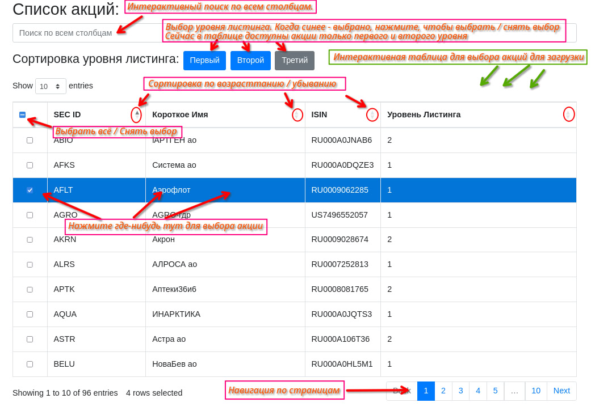
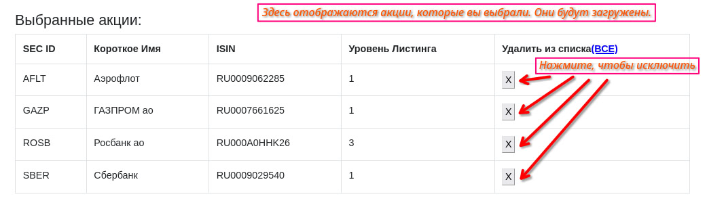
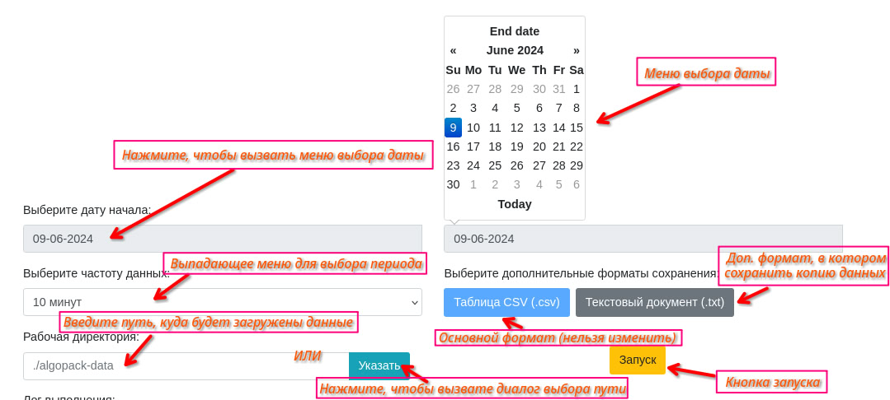
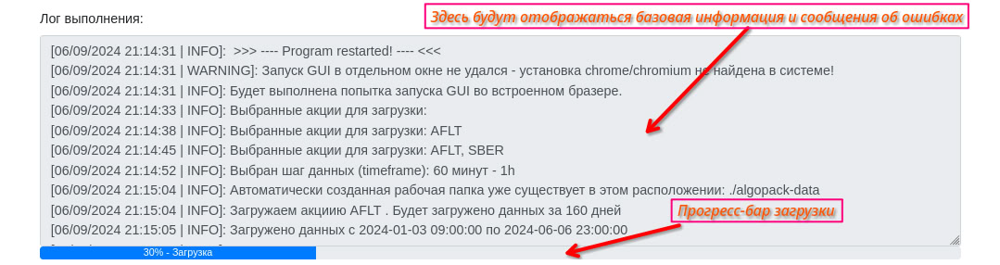

# Mosmarket App (ALGOPACK Акции GUI) - программа для загрузки исторических данных акций с Мосбиржы

Программа изначально делалась как учебный проект, для получения навыков разработки графических интерфейсов пользователя на базе [eel](https://github.com/python-eel/Eel). Он предоставляет простой loсal сервер и инструмент связи python и JavaScript.

Сама программа, по сути, осуществляет тот же функционал, что и "[Тахометр Трейдера](https://github.com/algotrading-py/TAHOMETR-TRADER)". Однако, алгоритм работы и загрузки принципиально разные. Также, я считаю, настройка параметров через такой интерфейс несколько удобнее. 

## Содержание

1. [Инструкция](#Инструкция)
2. [Использование](#Использование)
3. [Сборка и отладка](#Сборка-и-отладка)
4. [Известные ошибки и их решения](#Известные-ошибки-и-их-решения)
5. [Контакты и ссылки](#Контакты-и-ссылки)


## Инструкция

Далее последует мини инструкция-пояснение, в виде картинок, к графическому интерфейсу программы.









## Использование

Вы можете скачать собранную  версию программы (бинарник) в разделе [releases](https://github.com/tphlru/mosmarket/releases).
Он не требует установки, достаточно запустить.

GUI запускается в веб-браузере. По-умолчанию программа ищет установку браузеров chrome или chromium в системе, если таковые найдены, то программа откроется в отдельном окне. Если же нет, то программа запустится как отдельная вкладка в любом браузере, установленным по-умолчанию. Программа закроется как только вкладка или окно будут закрыты. 

В программе пока что не реализована дозагрузка в конец файлов.

## Сборка и отладка

Лог в logfile.log будет сохранён рядом с исполняемым файлом. Программа собрана под linux и windows c помощью ~~nuitka~~ pyinstaller. <u>**Программа плохо протестирована, поэтому пока она будет находится в условной beta - версии. Если найдёте ошибки - сообщайте мне в tg (https://t.me/Timur0820) или создайте issue на github.**<u>

Для сборки бинарника вручную, предлагаю использовать pyinstaller, так как eel уже адаптирован под него и имеет встроенный скрипт сборки.

```bash
git clone https://github.com/tphlru/mosmarket
cd mosmarket
python pip install -r requirements.txt
python -m eel main.py web --onefile --noconsole
```


## Известные ошибки и их решения
1. Когда программа запускается в браузере по-умолчанию, может не загрузиться таблица с акциями, а интерфейс не будет работать. 
> 	Решение: Это происходит, из-за того, что некоторые блокировщики рекламы (в т.ч. встроенная в FireFox "Улучшенная защита от отслеживания") портят или отключают JS скрипты, в том числе eel.js. Просто временно отключите их (или внесите localhost в исключения), перезапустите программу.


## Контакты и ссылки

- Telegram Разработчика - https://t.me/Timur0820
- email - t.tunkin@yandex.ru
- Сайт о алготрейдинге - https://алготрейдинг.рф/
- Канал о алготрейдинге - https://t.me/algotrading_step_to_step
- Мой сайт (там иногда выходят интересные статьи, но в основном экспериментирую) - https://tphl.ru 

Если вам понравилась программа - пожалуйста, поставьте звезду на этот репозиторий! 
